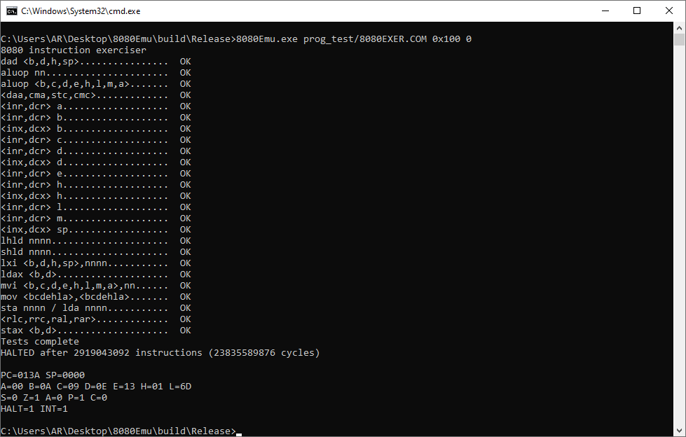
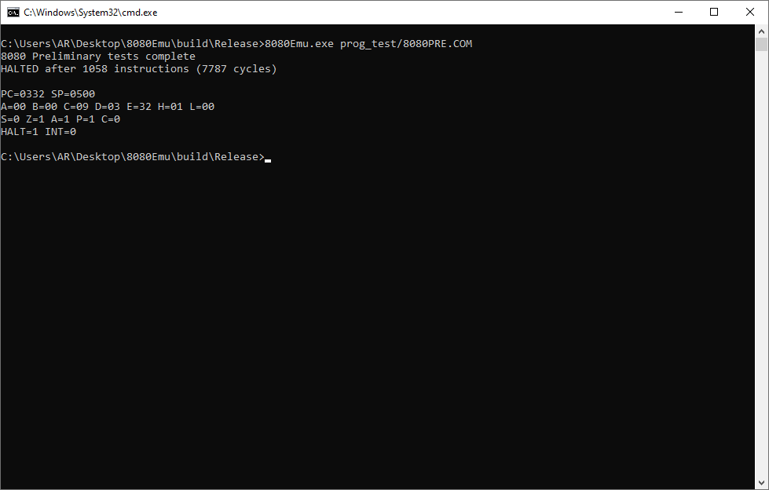
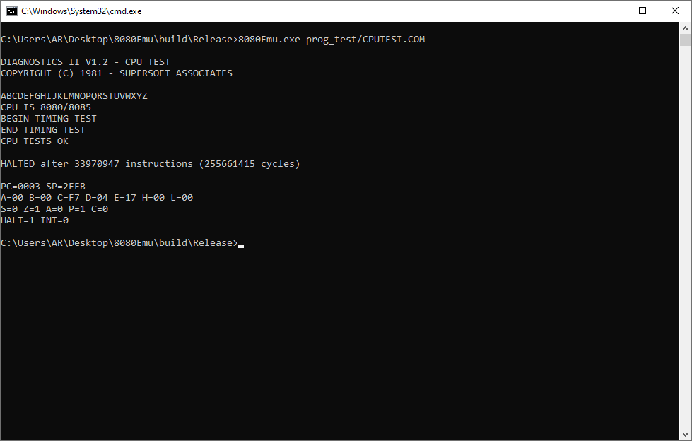
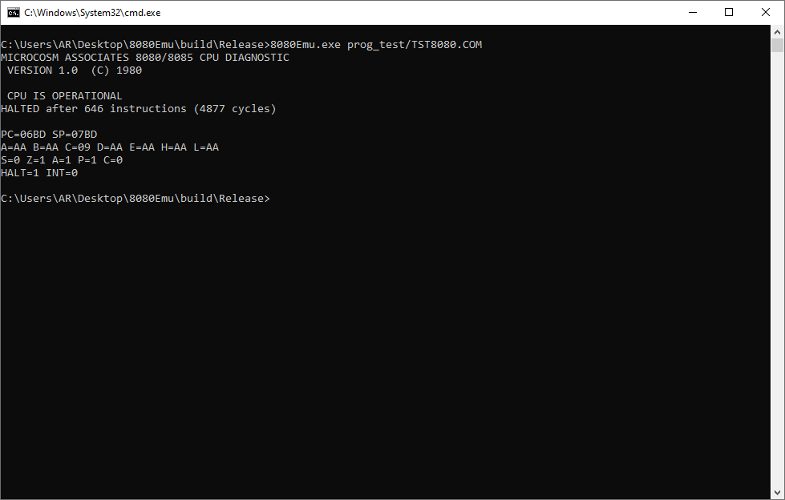

# Intel-8080-Emulator

This project is my take on implementing a working 8080 emulator with BDOS support, all 256 opcodes are implemented.

Below are the resources I used to work my way through this.

1. [Intel 8080 Assembly Language Programming Manual](http://bitsavers.informatik.uni-stuttgart.de/components/intel/MCS80/98-153D__MCS-80_Users_Manual_Oct77.pdf) (Didn't read the full manual, just chapter 4)
2. [Chapter 5 of CP/M Programmer's Handbook](http://cpmarchives.classiccmp.org/cpm/mirrors/electrickery.xs4all.nl/comp/divcomp/doc/TPCH05.pdf)

I tested the emulator on some popular test suites and it passes all of them (TST8080, 8080PRE, 8080EXER, 8080EXM, CPUTEST). The initial emulator couldn't pass these tests and I had to spend a lot of time fixing typos and logical errors, but thankfully it worked before I even had the idea of abandoning the project xD.

As with my other projects, once it works and passes all tests, I tend to move on to the next thing. There might be some obscure edge cases I haven't encountered, but for all practical purposes, this emulator can run 8080 programs.

## Test Results
|  |  |
|---------------------------------------|-------------------------------------|
|  |  |
|  |  |

## Building

This project uses CMake for building. To compile:

```bash
mkdir build
cd build
cmake ..
cmake --build . --config Release
```

## Running Tests

The test programs are included in the `build/Release/prog_test` directory. Run the emulator with any of the `.COM` files to see the test results. You can check the full commands from the screenshots. Some programs require a lot of cycles, so to specify it through the command line, we have to pass "0" and this is why in some of the screenshots you will notice that the command has "0x100" (starting address) and "0" (unlimited cycles) at the end while others don't. This is because the CLI can automatically detect the type of program e.g. CP/M or COM and change the starting addresses accordingly but because the CLI is structured such that it takes starting address of program first (if given) and then the cycles, so we have to pass the starting address otherwise if we pass "0" as is, it would take that as the starting address instead of unlimited cycles.